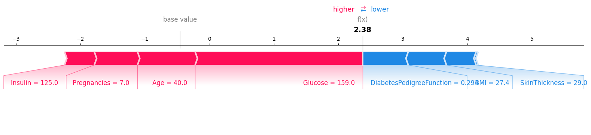
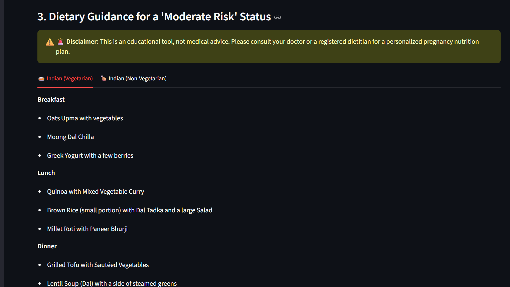
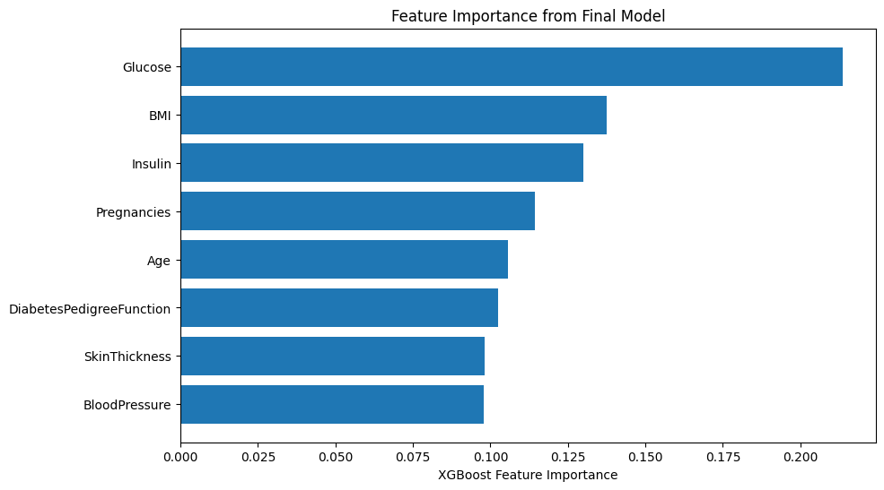
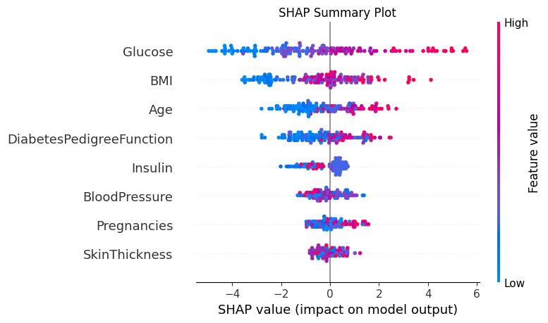

# 🤰 Diabetes Prediction For Preganant Women

An end-to-end machine learning application that assesses the risk of **Gestational Diabetes Mellitus (GDM)** in expectant mothers and provides personalized, pregnancy-safe dietary recommendations.


---

## ✨ Project Overview

This project was developed to provide an accessible, data-driven tool for the early assessment of Gestational Diabetes risk. Leveraging a powerful **XGBoost** model, the application delivers not just a prediction but a comprehensive analysis, including:

-   A multi-tiered risk score (Minimal, Low, Moderate, High).
-   An explainable AI (XAI) breakdown showing *why* the model made its decision.
-   Tailored, pregnancy-safe dietary plans for both vegetarian and non-vegetarian Indian cuisines.

The entire application is built with a user-friendly interface using Streamlit, making complex machine learning insights understandable and actionable.

---

## 🎯 Key Features

### 📈 Multi-Tier Risk Assessment & Visualization
The app translates the raw probability score into four clear, color-coded risk levels and displays it on an intuitive gauge chart.


### 🤖 Explainable AI (XAI) with SHAP
Users can click to see an interactive SHAP force plot that explains exactly which factors contributed to their specific risk score, and by how much. This builds trust and transparency.



### 🥗 Personalized Dietary Guidance
Based on the predicted risk level, the app provides detailed, pregnancy-safe meal suggestions using convenient tabs for vegetarian and non-vegetarian Indian diets.



---

## 🔬 Behind the Scenes: Model Insights

The model's reliability is backed by a thorough analysis of its behavior.

#### Feature Importance
Glucose, BMI, and Insulin levels were identified as the most influential factors in predicting GDM risk.



#### Global SHAP Analysis
The SHAP summary plot confirms the model learned medically relevant patterns. For instance, high Glucose values (red dots) consistently and strongly push the prediction towards a higher risk.



---

## 🛠️ Tech Stack

-   **Programming Language:** `Python`
-   **Data Science & ML:** `Pandas`, `NumPy`, `Scikit-learn`, `XGBoost`, `SHAP`
-   **Web Framework:** `Streamlit`
-   **Data Visualization:** `Plotly`, `Matplotlib`
-   **Model Persistence:** `Joblib`

---

## ⚙️ How to Run This Project Locally

1.  **Clone the Repository:**
    ```bash
    git clone https://github.com/Rudhan7676/Diabetes-Prediction-For-Preganant-Women-.git
    cd Diabetes-Prediction-For-Preganant-Women-
    ```

2.  **Install Dependencies:**
    ```bash
    pip install -r requirements.txt
    ```

3.  **Run the App:**
    ```bash
    streamlit run app.py
    ```

Your web browser should automatically open with the app running! 🎉
